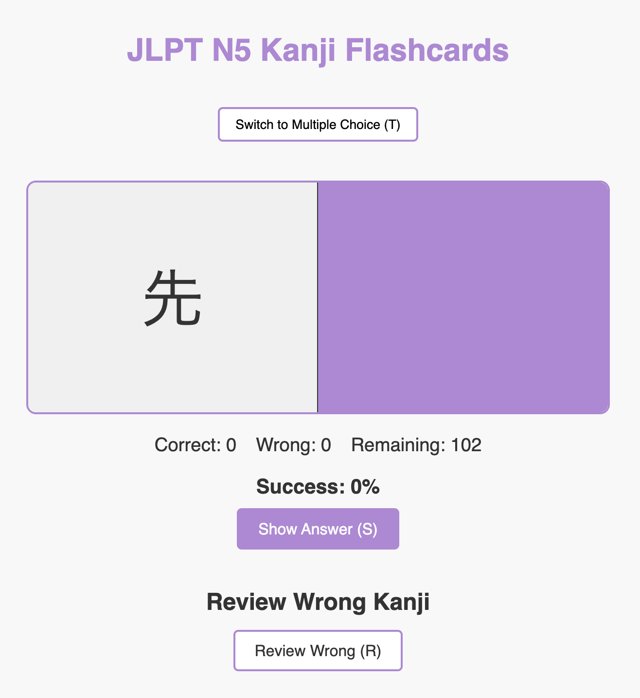
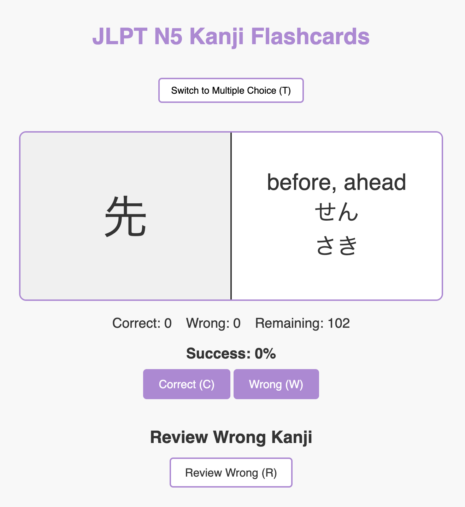
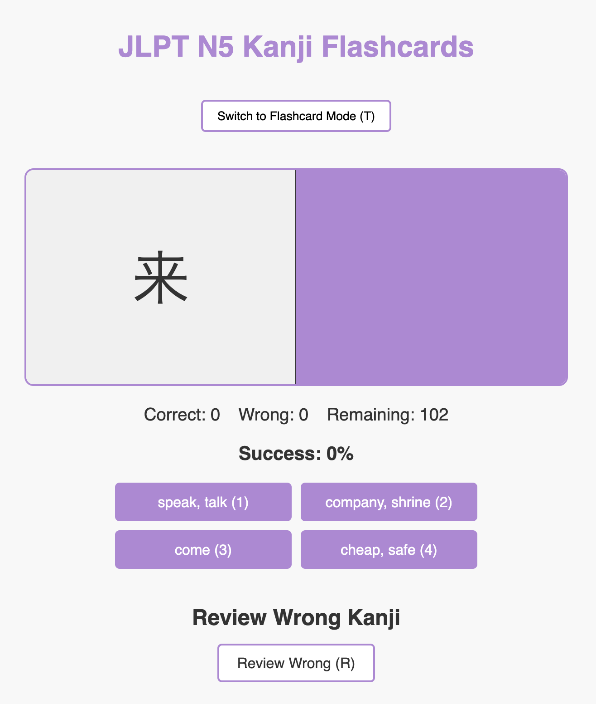
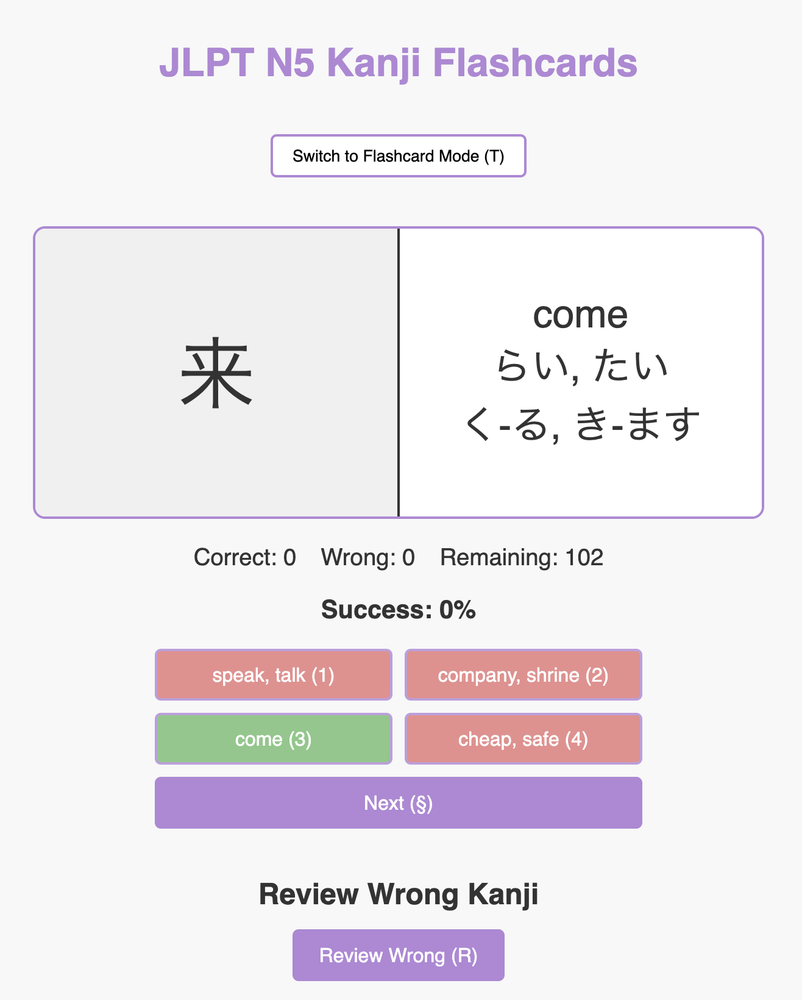

<h1 align="center"> 🎴 JLPT N5 Kanji Flashcards 🎴</h1>

A simple, interactive web-based flashcard tool for learning **JLPT N5 kanji**.  
Now includes **two learning modes** to suit different study styles: traditional flashcards and multiple-choice quizzes.

## Demo

You can run the webpage locally by opening `index.html` in your browser, or check out the live version here:

  <a href="https://emmavellard.github.io/JapaneseFlashcards/" target="_blank">
    🌐 View Live Website
  </a>

---

## Modes

### **1. Flashcard Mode**
Test yourself by recalling the meaning and readings before revealing the answer.

  
  

**How it works:**
- A kanji is displayed.
- Press **"Show Answer"** (or `S` key) to reveal its **meaning**, **onyomi**, and **kunyomi**.
- Mark it as **Correct** (`C` key) or **Wrong** (`W` key).
- All wrong answers can be reviewed later in the “Review Wrong Kanji” section.

---

### **2. Multiple Choice Mode**
Choose the correct meaning from 4 possible answers.

  
  

**How it works:**
- A kanji is shown along with **4 possible meanings**.
- Select your answer with a click **or** by pressing `1`, `2`, `3`, or `4`.
- Correct answers are highlighted in **green**, wrong ones in **pink**.
- Press **"Next"** (or `N` key) to go to the next question.
- Counters for correct, wrong, and remaining are tracked separately for each mode.

---

## Keyboard Shortcuts

**Flashcard Mode:**
- `S` → Show answer
- `C` → Mark correct
- `W` → Mark wrong

**Multiple Choice Mode:**
- `1`–`4` → Select an answer
- `N` → Next question

**Both Modes:**
- `M` → Switch between modes
- `R` → Review wrong kanji

---

## Features

- Two modes: **Flashcards** and **Multiple Choice**.
- Tracks correct, wrong, remaining, and success rate separately for each mode.
- Review section for studying mistakes.
- Responsive design that works on desktop and mobile.
- Matching color scheme for correct/wrong answers for visual clarity.

---

## Files

- `index.html` – Main HTML structure.
- `style.css` – Styles for flashcards, multiple choice, and responsive layout.
- `Lists/kanjiN5.js` – Data file containing the list of N5 kanji with readings and meanings.
- `script.js` – JavaScript logic for both modes, scoring, shortcuts, and review.

