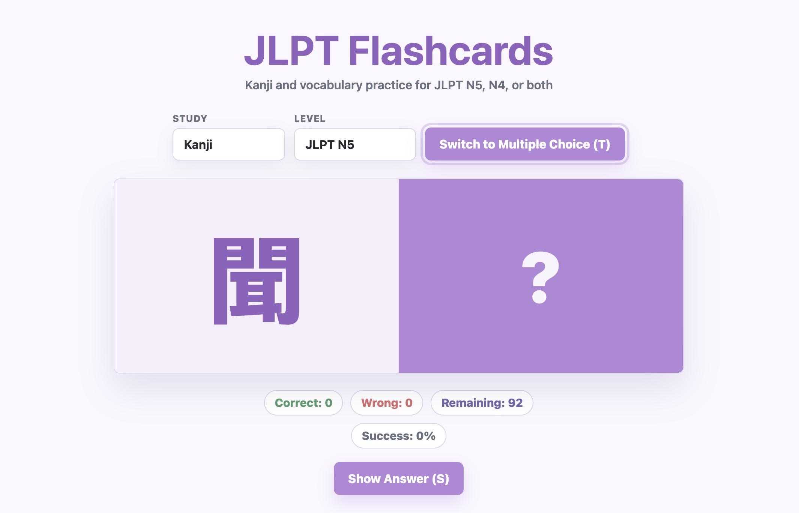
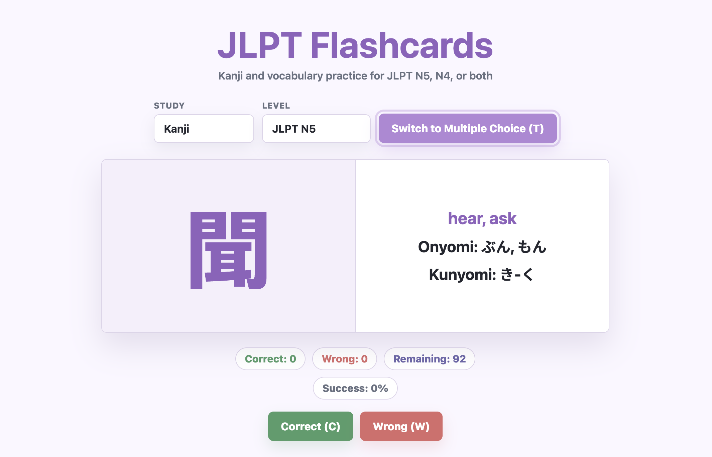
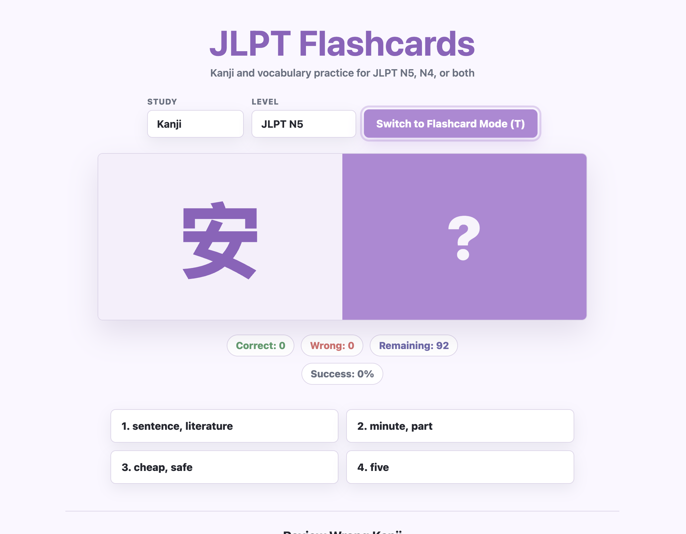
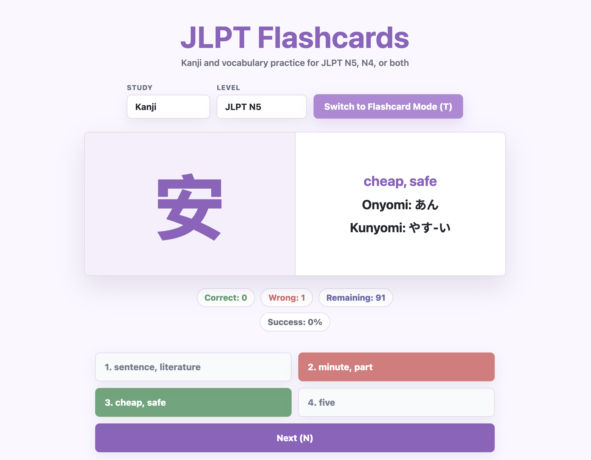

## 🎴 JLPT Flashcards

A simple, interactive web-based flashcard tool for learning **JLPT N5 and N4 kanji and vocabulary**.
Now includes **two learning modes** to suit different study styles: traditional flashcards and multiple-choice quizzes.

## Demo

You can run the webpage locally by opening `index.html` in your browser, or check out the live version here:

  <a href="https://emmavellard.github.io/JapaneseFlashcards/" target="_blank">
    🌐 View Live Website
  </a>

## Modes

Choose your study type (**Kanji** or **Vocabulary**) and level (**N5**, **N4**, or **N5 + N4**) from the selectors, then study the selected list in either mode.

> Note: JLPT level lists are study references rather than official fixed exam lists. The vocabulary decks are curated starter lists and can be expanded over time.

### **1. Flashcard Mode**
Test yourself by recalling the meaning and readings before revealing the answer.

  
  

**How it works:**
- A kanji or vocabulary word is displayed.
- Press **"Show Answer"** (or `S` key) to reveal its answer details.
- Mark it as **Correct** (`C` key) or **Wrong** (`W` key).
- All wrong answers can be reviewed later in the “Review Wrong” section.

### **2. Multiple Choice Mode**
Choose the correct meaning or reading from 4 possible answers.

  
  

**How it works:**
- A kanji or vocabulary word is shown with **4 possible answers**.
- Multiple-choice questions can ask for either the meaning or the reading when useful reading options are available.
- Vocabulary quiz cards show the kana reading above words that use kanji.
- Select your answer with a click **or** by pressing `1`, `2`, `3`, or `4`.
- Correct answers are highlighted in **green**, wrong ones in **red**.
- Press **"Next"** / **"Finish"** (or `N` key) to move forward.
- Counters for correct, wrong, remaining, and success rate are tracked for the current session.

## Keyboard Shortcuts

**Flashcard Mode:**
- `S` → Show answer
- `C` → Mark correct
- `W` → Mark wrong

**Multiple Choice Mode:**
- `1`–`4` → Select an answer
- `N` → Next question

**Both Modes:**
- `T` → Switch between modes
- `R` → Review wrong kanji

## Features

- Separate **JLPT N5** and **JLPT N4** kanji lists.
- Separate **JLPT N5** and **JLPT N4** vocabulary starter lists, including hiragana-only and katakana words.
- Combined **N5 + N4** sessions for studying both levels together.
- Browse pages for the full included kanji and vocabulary lists.
- Two modes: **Flashcards** and **Multiple Choice**.
- Tracks correct, wrong, remaining, and success rate for the current session.
- Ends the session cleanly after each card has appeared once.
- Review section for studying mistakes.
- Responsive design that works on desktop and mobile.
- Matching color scheme for correct/wrong answers for visual clarity.

## Files

- `index.html` – Main HTML structure.
- `kanji.html` – Browse page for all included N5 and N4 kanji.
- `vocabulary.html` – Browse page for all included N5 and N4 vocabulary.
- `list-pages.js` – Rendering logic for the browse pages.
- `style.css` – Styles for flashcards, multiple choice, and responsive layout.
- `Lists/kanjiN5.js` – Data file containing the list of N5 kanji with readings and meanings.
- `Lists/kanjiN4.js` – Data file containing the list of N4 kanji with readings and meanings.
- `Lists/vocabN5.js` – Data file containing N5 vocabulary, including hiragana and katakana words.
- `Lists/vocabN4.js` – Data file containing N4 vocabulary, including hiragana and katakana words.
- `script.js` – JavaScript logic for both modes, scoring, shortcuts, and review.
